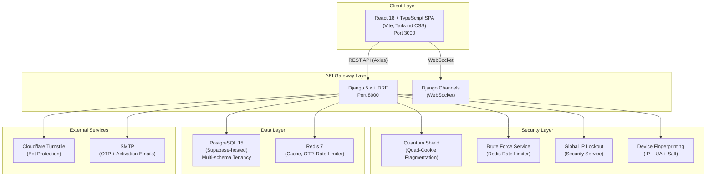
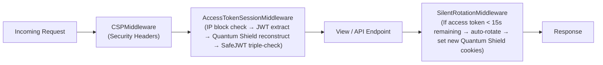

# AUIP Platform — System Architecture

This document describes the technical architecture of the AUIP platform.

---

## 1. High-Level Architecture



---

## 2. Backend Architecture

The Django backend uses a **feature-service** app structure. Each Django app represents a bounded context.

### App Registry

| App | Path | Description |
|-----|------|-------------|
| `identity` | `backend/apps/identity/` | Auth, users, sessions, institutions, Quantum Shield, tokens, passwords, OTP |
| `auip_tenant` | `backend/apps/auip_tenant/` | django-tenants `Client` and `Domain` models for schema isolation |
| `auip_institution` | `backend/apps/auip_institution/` | Tenant-specific institution model (`PreSeededRegistry`) |
| `academic` | `backend/apps/academic/` | Course, Batch, Department management |
| `quizzes` | `backend/apps/quizzes/` | Quiz engine with question banks |
| `attempts` | `backend/apps/attempts/` | Attempt tracking and scoring |
| `anti_cheat` | `backend/apps/anti_cheat/` | Tab-switch detection, fullscreen enforcement |
| `analytics` | `backend/apps/analytics/` | Reporting and metrics |
| `governance` | `backend/apps/governance/` | AI Governance Brain |
| `intelligence` | `backend/apps/intelligence/` | ML prediction models |
| `notifications` | `backend/apps/notifications/` | Push/email notification service |
| `placement` | `backend/apps/placement/` | Placement drives, eligibility engine |

---

## 3. Identity Service — Internal Architecture

The `identity` app is the core service — authorization, authentication, session management, and institutional governance all live here.

```
backend/apps/identity/
├── models/
│   ├── core_models.py         # User, CoreStudent, StudentProfile, TeacherProfile, Subject, PasswordResetRequest
│   ├── auth_models.py         # BlacklistedAccessToken, LoginSession, RememberedDevice
│   ├── institution.py         # Institution, InstitutionAdmin
│   └── invitation.py          # RegistrationInvitation
│
├── views/
│   ├── admin/                 # Super Admin views (institution CRUD, approve/reject)
│   ├── auth/                  # Login/logout endpoints (V1, V2)
│   ├── public/                # Public registration (Turnstile-protected)
│   ├── password/              # Password change, reset
│   ├── profile/               # User profile endpoints
│   ├── social/                # Social auth (Google OAuth)
│   ├── user/                  # User management views
│   ├── admin_auth_views.py    # Super Admin MFA login flow
│   ├── device_sessions.py     # Session listing, remote deactivation
│   └── security_views.py      # Security diagnostics
│
├── services/
│   ├── quantum_shield.py      # ⭐ Quad-Segment Cookie Fragmentation
│   ├── token_service.py       # JWT session creation, rotation, logout, fingerprint verification
│   ├── auth_service.py        # Centralized login hub (password + OTP + MFA paths)
│   ├── activation_service.py  # Student account activation
│   ├── password_service.py    # Password hashing, validation
│   ├── reset_service.py       # Password reset token lifecycle
│   ├── brute_force_service.py # Per-identifier rate limiting (Redis)
│   └── security_service.py    # Global IP lockout + email incident reports
│
├── utils/
│   ├── security.py            # HMAC hashing with key rotation
│   ├── cookie_utils.py        # Quantum Shield cookie set/clear + legacy compat
│   ├── multitenancy.py        # create_institution_schema(), schema_context()
│   ├── turnstile.py           # Cloudflare Turnstile token verification
│   ├── email_utils.py         # Email sending (OTP, activation, password reset)
│   ├── otp_utils.py           # OTP generation, verification (user-based + identifier-based)
│   ├── device_utils.py        # Device fingerprinting (SHA256 of IP+UA+salt)
│   ├── activation.py          # Activation token (Django TimestampSigner)
│   ├── cookie_utils.py        # Quantum Shield set/clear helpers
│   ├── cache_utils.py         # Redis cache key generation
│   ├── request_utils.py       # IP extraction from X-Forwarded-For
│   ├── response_utils.py      # Standardized API responses
│   └── jit_admin.py           # Just-In-Time admin provisioning
│
├── middleware.py               # AccessTokenSessionMiddleware + SilentRotationMiddleware
├── middleware_csp.py           # Content Security Policy headers
├── middleware_jwt.py           # WebSocket JWT auth for Django Channels
├── authentication.py           # SafeJWTAuthentication (triple-check)
├── permissions.py              # 6 RBAC permission classes
├── consumers.py                # WebSocket consumers (session sync + institutional hub)
├── routing.py                  # WebSocket URL routing
├── signals.py                  # Institution change broadcasts
├── constants.py                # Platform-wide constants
├── adapters.py                 # allauth social adapters
└── tests/                      # 13 test files
```

---

## 4. Frontend Architecture

```
frontend/src/
├── features/
│   ├── auth/
│   │   ├── pages/
│   │   │   ├── SuperAdminLogin.tsx        # Admin login (email + password + OTP + Quantum Shield)
│   │   │   ├── Login.tsx                  # General login portal
│   │   │   ├── StudentLogin.tsx           # OTP-based passwordless login
│   │   │   ├── FacultyLogin.tsx           # Faculty login
│   │   │   ├── RegisterUniversity.tsx     # Public institution registration (Turnstile)
│   │   │   ├── StudentRegistration.tsx    # Student self-registration
│   │   │   ├── ActivationRequest.tsx      # Student activation request
│   │   │   ├── Activate.tsx              # Account activation page
│   │   │   ├── AdminRecovery.tsx         # Admin password recovery
│   │   │   └── SecureDevice.tsx          # Device trust page
│   │   │
│   │   ├── components/
│   │   │   └── TurnstileWidget.tsx        # Cloudflare Turnstile integration
│   │   │
│   │   ├── hooks/
│   │   │   ├── useSilentRefresh.ts       # Auto-refresh access tokens before expiry
│   │   │   └── useSecureRotation.ts      # Token rotation via X-New-Access-Token header
│   │   │
│   │   ├── context/
│   │   │   └── AuthProvider/             # Auth context + session WebSocket
│   │   │
│   │   └── layouts/
│   │       └── AppLayout.tsx             # Authenticated app shell
│   │
│   ├── dashboard/
│   │   └── pages/
│   │       ├── InstitutionAdmin.tsx       # Super Admin institution hub (40KB, full CRUD)
│   │       ├── CoreStudentAdmin.tsx       # Student data management (17KB, grid/list views)
│   │       ├── Dashboard.tsx             # Main dashboard
│   │       └── LandingPage.tsx           # Public landing page
│   │
│   └── user/                             # User profile components
│
├── components/                           # Shared UI components
├── lib/                                  # Axios client, utilities
└── shared/                               # Shared types, constants
```

---

## 5. Data Models (Entity Relationship)

```mermaid
erDiagram
    Institution ||--o{ InstitutionAdmin : "has admins"
    Institution ||--o{ CoreStudent : "seeds students"
    Institution {
        string name
        string slug
        string domain
        string status
        json registration_data
        string schema_name
        bool is_active
    }

    User ||--o| StudentProfile : "has profile"
    User ||--o| TeacherProfile : "has profile"
    User ||--o| InstitutionAdmin : "is admin"
    User ||--o{ LoginSession : "has sessions"
    User ||--o{ BlacklistedAccessToken : "blacklisted tokens"
    User ||--o{ RememberedDevice : "trusted devices"
    User ||--o{ PasswordResetRequest : "reset requests"
    User {
        uuid id
        string email
        string role
        FK core_student
        FK institution
    }

    CoreStudent ||--o| User : "linked via stu_ref"
    CoreStudent {
        string stu_ref PK
        string roll_number
        string full_name
        string department
        decimal cgpa
        string status
        FK institution
    }

    LoginSession {
        string jti
        string token_hash
        string refresh_jti
        string device_fingerprint
        string device_salt
        string ip_address
        string device_type
        string browser_info
        bool is_active
        datetime expires_at
    }

    RegistrationInvitation {
        string token_hash
        string status
        FK institution
        datetime expires_at
    }
```

---

## 6. Middleware Pipeline

Every HTTP request passes through this pipeline:



---

## 7. API Endpoint Map

### Public Endpoints (No Auth)
| Method | Endpoint | Handler | Purpose |
|--------|----------|---------|---------|
| `POST` | `/api/users/public/register/` | `InstitutionRegistrationView` | Register institution |
| `GET` | `/api/users/public/config/` | — | Platform config (Turnstile keys) |

### Authentication Endpoints
| Method | Endpoint | Purpose |
|--------|----------|---------|
| `POST` | `/api/auth/v2/admin/login/` | Super Admin login (step 1: password) |
| `POST` | `/api/auth/v2/admin/verify-otp/` | Super Admin OTP verification (step 2) |
| `POST` | `/api/auth/v2/student/login/` | Student OTP login |
| `POST` | `/api/auth/v2/student/verify-otp/` | Student OTP verification |
| `POST` | `/api/auth/v2/token/refresh/` | Refresh access token |
| `POST` | `/api/auth/v2/logout/` | Logout (invalidate session + blacklist tokens) |

### Admin Endpoints (Super Admin)
| Method | Endpoint | Purpose |
|--------|----------|---------|
| `GET` | `/api/institutions/` | List all institutions |
| `POST` | `/api/institutions/{id}/approve/` | Approve + create schema |
| `POST` | `/api/institutions/{id}/reject/` | Reject institution |

### Session Endpoints
| Method | Endpoint | Purpose |
|--------|----------|---------|
| `GET` | `/api/sessions/` | List active sessions |
| `DELETE` | `/api/sessions/{id}/` | Deactivate a session |

---

## 8. Docker Compose Services

| Service | Image | Port | Purpose |
|---------|-------|------|---------|
| `redis` | `redis:7-alpine` | 6379 | Cache, OTP store, rate limiter |
| `backend` | Custom (Django) | 8000 | REST API + WebSocket |
| `frontend` | Custom (Vite) | 3000 | React SPA |

> PostgreSQL is hosted on **Supabase** (cloud) — not containerized locally. The `postgres` service definition in `docker-compose.yml` is commented out for local dev.
