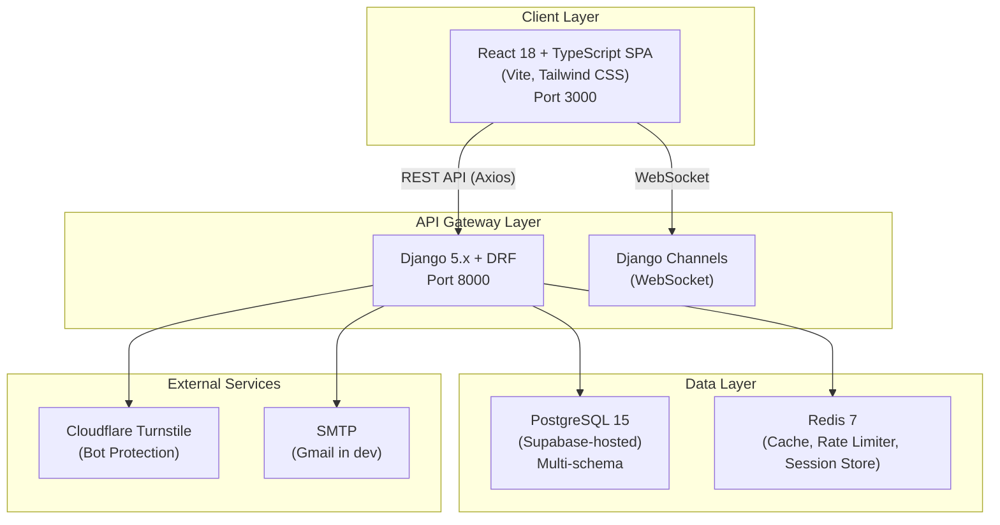

# AUIP Platform — System Architecture

This document describes the technical architecture of the AUIP platform as it is currently implemented. Items explicitly marked as **[PLANNED]** are not yet built.

---

## 1. High-Level Architecture



---

## 2. Backend Architecture

The Django backend uses a **feature-service** app structure. Each Django app represents a bounded context.

### Implemented Apps

| App | Path | Description | File Count |
|-----|------|-------------|------------|
| `identity` | `backend/apps/identity/` | Auth, users, sessions, institutions, tokens, passwords | ~128 files |
| `auip_tenant` | `backend/apps/auip_tenant/` | django-tenants `Client` and `Domain` models | ~8 files |
| `auip_institution` | `backend/apps/auip_institution/` | Institution-specific tenant model | ~6 files |
| `academic` | `backend/apps/academic/` | Course and Batch models (scaffolded, not fully wired) | ~11 files |
| `quizzes` | `backend/apps/quizzes/` | Quiz models (migrated from old exam_portal, not actively developed) | ~10 files |
| `attempts` | `backend/apps/attempts/` | Attempt tracking (migrated, not actively developed) | ~11 files |
| `anti_cheat` | `backend/apps/anti_cheat/` | Tab-switch detection (migrated, not actively developed) | ~11 files |

### Empty Scaffolds (Not Started)

| App | Path | Status |
|-----|------|--------|
| `governance` | `backend/apps/governance/` | Empty directory |
| `intelligence` | `backend/apps/intelligence/` | Empty directory |
| `notifications` | `backend/apps/notifications/` | Empty directory |
| `placement` | `backend/apps/placement/` | Empty directory |

---

## 3. Identity Service — Deep Dive

The `identity` app is the most mature and complex service. Here is its internal structure:

```
backend/apps/identity/
├── models/
│   ├── core_models.py         # User, CoreStudent, StudentProfile, TeacherProfile, Subject, PasswordResetRequest
│   ├── auth_models.py         # BlacklistedAccessToken, LoginSession, RememberedDevice
│   ├── institution.py         # Institution, InstitutionAdmin
│   └── invitation.py          # RegistrationInvitation
│
├── views/
│   ├── admin/                 # Super Admin views (institution management, user management)
│   │   └── institution_views.py  # InstitutionViewSet (CRUD + approve/reject actions)
│   ├── auth/                  # Login/logout endpoints
│   ├── public/                # Public registration endpoint
│   │   └── registration.py    # InstitutionRegistrationView (Turnstile-protected)
│   ├── password/              # Password change, reset
│   ├── profile/               # User profile endpoints
│   ├── social/                # Social auth (Google OAuth)
│   ├── device_sessions.py     # Session listing, deactivation
│   ├── admin_auth_views.py    # Super Admin auth flow
│   └── security_views.py      # Security utilities
│
├── services/
│   ├── token_service.py       # JWT access/refresh token creation & validation
│   ├── auth_service.py        # Core login/logout logic
│   ├── activation_service.py  # Student account activation
│   ├── password_service.py    # Password hashing, validation
│   ├── reset_service.py       # Password reset token lifecycle
│   ├── brute_force_service.py # Rate limiting and lockout
│   ├── security_service.py    # HMAC token generation
│   └── quantum_shield.py      # Additional security layer
│
├── utils/
│   ├── multitenancy.py        # create_institution_schema(), schema_context()
│   ├── turnstile.py           # Cloudflare Turnstile token verification
│   ├── email_utils.py         # Email sending (activation, password reset)
│   ├── security.py            # HMAC hashing (hash_token, hash_token_secure)
│   ├── cookie_utils.py        # Secure cookie management
│   ├── otp_utils.py           # OTP generation and validation
│   ├── device_utils.py        # Device fingerprinting
│   └── response_utils.py      # Standardized API responses
│
├── middleware.py               # JWT authentication middleware
├── middleware_csp.py           # Content Security Policy headers
├── middleware_jwt.py           # JWT extraction from cookies
├── permissions.py              # RBAC permission classes
├── consumers.py                # WebSocket consumers (session sync)
├── routing.py                  # WebSocket URL routing
├── signals.py                  # Django signals (post-save hooks)
└── tests/                      # 13 test files
```

---

## 4. Frontend Architecture

```
frontend/src/
├── features/
│   ├── auth/
│   │   ├── pages/
│   │   │   ├── SuperAdminLogin.tsx        # Admin login (email + password + OTP)
│   │   │   ├── Login.tsx                  # General login portal
│   │   │   ├── StudentLogin.tsx           # OTP-based student login
│   │   │   ├── FacultyLogin.tsx           # Faculty login
│   │   │   ├── RegisterUniversity.tsx     # Public institution registration
│   │   │   ├── StudentRegistration.tsx    # Student self-registration
│   │   │   ├── ActivationRequest.tsx      # Student activation request
│   │   │   ├── Activate.tsx              # Account activation page
│   │   │   ├── AdminRecovery.tsx         # Admin password recovery
│   │   │   └── SecureDevice.tsx          # Device trust page
│   │   │
│   │   ├── api/                          # API client functions
│   │   │   ├── secureDeviceApi.ts
│   │   │   └── studentApi.ts
│   │   │
│   │   ├── components/                   # Auth UI components
│   │   │   └── TurnstileWidget.tsx        # Cloudflare Turnstile integration
│   │   │
│   │   ├── context/
│   │   │   └── AuthProvider/             # Auth context + session WebSocket
│   │   │
│   │   ├── hooks/
│   │   │   ├── useSilentRefresh.ts       # Auto-refresh access tokens
│   │   │   └── useSecureRotation.ts      # Token rotation
│   │   │
│   │   └── layouts/
│   │       └── AppLayout.tsx             # Authenticated app shell
│   │
│   ├── dashboard/
│   │   └── pages/
│   │       ├── InstitutionAdmin.tsx       # Super Admin institution hub (40KB)
│   │       ├── CoreStudentAdmin.tsx       # Student data management (17KB)
│   │       ├── Dashboard.tsx             # Main dashboard
│   │       └── LandingPage.tsx           # Public landing page
│   │
│   └── user/                             # User profile components
│
├── components/                           # Shared UI components
├── lib/                                  # Axios client, utilities
└── shared/                               # Shared types, constants
```

---

## 5. Data Models (Entity Relationship)

```mermaid
erDiagram
    Institution ||--o{ InstitutionAdmin : "has admins"
    Institution ||--o{ CoreStudent : "seeds students"
    Institution {
        string name
        string slug
        string domain
        string status
        json registration_data
        string schema_name
        bool is_active
    }

    User ||--o| StudentProfile : "has profile"
    User ||--o| TeacherProfile : "has profile"
    User ||--o| InstitutionAdmin : "is admin"
    User ||--o{ LoginSession : "has sessions"
    User ||--o{ BlacklistedAccessToken : "has blacklisted tokens"
    User ||--o{ RememberedDevice : "has devices"
    User ||--o{ PasswordResetRequest : "requests resets"
    User {
        uuid id
        string email
        string role
        FK core_student
        FK institution
    }

    CoreStudent ||--o| User : "linked via stu_ref"
    CoreStudent {
        string stu_ref PK
        string roll_number
        string full_name
        string department
        decimal cgpa
        string status
        FK institution
    }

    LoginSession {
        string jti
        string token_hash
        string refresh_jti
        string device_fingerprint
        string ip_address
        bool is_active
    }
```

---

## 6. API Endpoint Map (Implemented)

### Public Endpoints (No Auth Required)
| Method | Endpoint | Handler | Purpose |
|--------|----------|---------|---------|
| `POST` | `/api/users/public/register/` | `InstitutionRegistrationView` | Register a new institution |
| `GET` | `/api/users/public/config/` | — | Get platform config (Turnstile keys) |

### Authentication Endpoints
| Method | Endpoint | Handler | Purpose |
|--------|----------|---------|---------|
| `POST` | `/api/auth/v2/admin/login/` | `AdminLoginView` | Super Admin login |
| `POST` | `/api/auth/v2/student/login/` | — | Student OTP login |
| `POST` | `/api/auth/v2/token/refresh/` | — | Refresh access token |
| `POST` | `/api/auth/v2/logout/` | — | Logout (invalidate tokens) |

### Admin Endpoints (Super Admin Only)
| Method | Endpoint | Handler | Purpose |
|--------|----------|---------|---------|
| `GET` | `/api/institutions/` | `InstitutionViewSet` | List all institutions |
| `POST` | `/api/institutions/{id}/approve/` | `InstitutionViewSet.approve` | Approve institution & create schema |
| `POST` | `/api/institutions/{id}/reject/` | `InstitutionViewSet.reject` | Reject institution |

### Session Endpoints
| Method | Endpoint | Handler | Purpose |
|--------|----------|---------|---------|
| `GET` | `/api/sessions/` | `DeviceSessionView` | List active sessions |
| `DELETE` | `/api/sessions/{id}/` | `DeviceSessionView` | Deactivate a session |

> [!NOTE]
> The full URL routing is defined in [backend/apps/identity/urls.py](file:///c:/Manohar/AUIP/AUIP-Platform/backend/apps/identity/urls.py).

---

## 7. Docker Compose Services

The `docker-compose.yml` defines 3 active services:

| Service | Image | Port | Status |
|---------|-------|------|--------|
| `redis` | `redis:7-alpine` | 6379 | ✅ Active |
| `backend` | Custom (Django) | 8000 | ✅ Active |
| `frontend` | Custom (Vite) | 3000 | ✅ Active |

> [!NOTE]
> PostgreSQL is **not** containerized — it's hosted on Supabase. The `postgres` service definition in `docker-compose.yml` is commented out.
