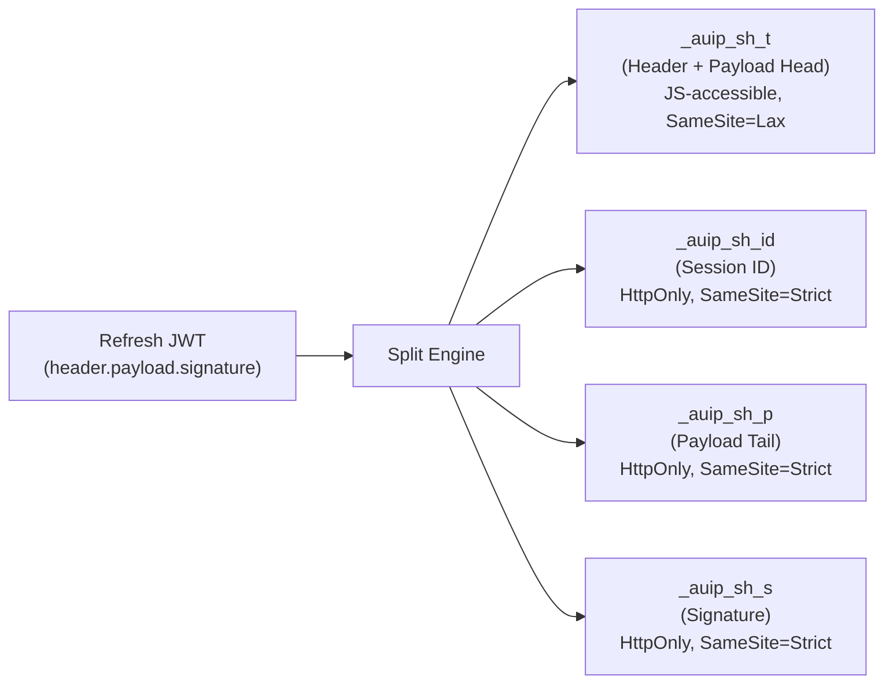
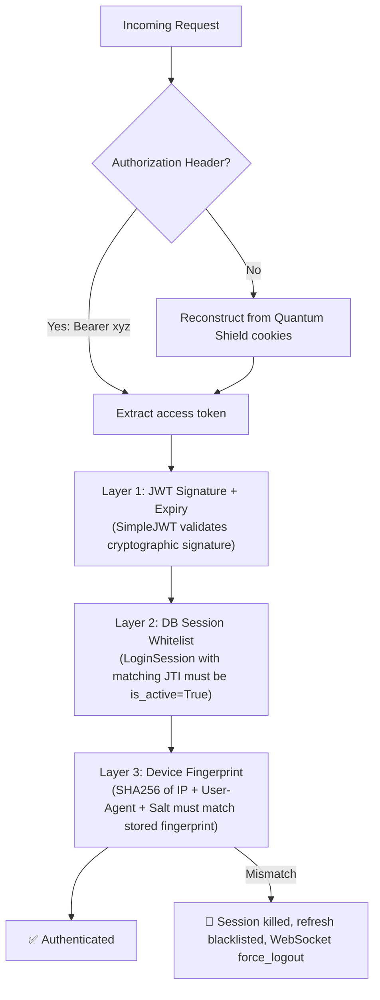
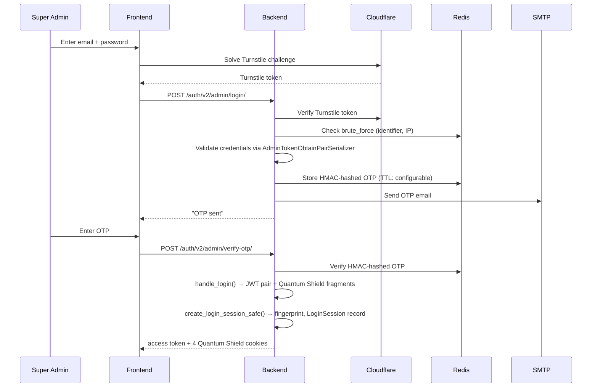
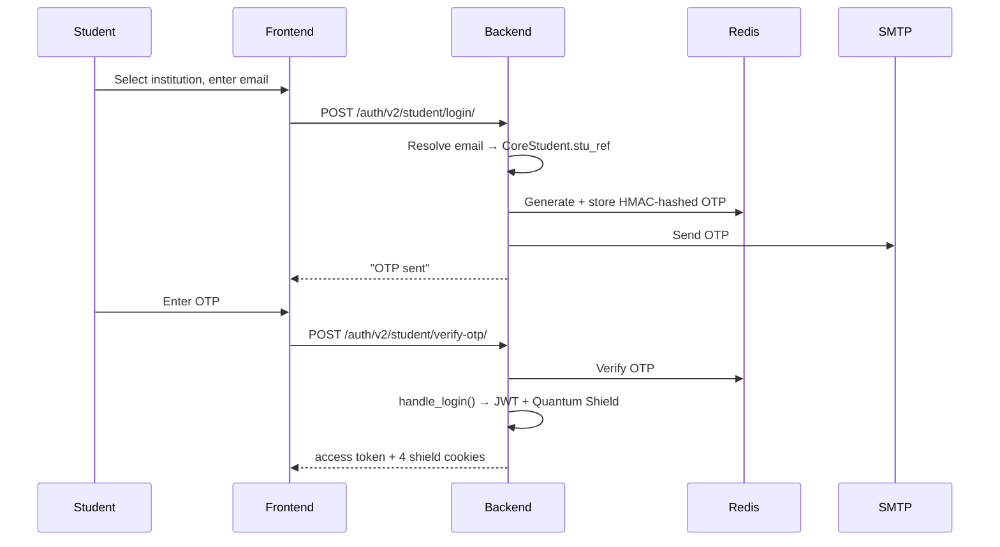

# AUIP Platform — Security & Authentication

This document covers the Quantum Shield architecture, authentication flows, token management, session lifecycle, and all defensive security layers in the AUIP platform.

---

## 1. The Quantum Shield — Quad-Segment Cookie Fragmentation

**This is the centerpiece of AUIP's session security.**

Traditional web apps store the refresh token as a single HttpOnly cookie. If that cookie is ever stolen (via XSS, MITM, or browser exploit), the attacker gains full session access. AUIP eliminates this attack vector entirely.

### How It Works

The refresh JWT (`header.payload.signature`) is **never stored as a single cookie**. Instead, it is split into 4 segments across separate cookies with different security properties:



| Segment | Cookie Name | Contents | HttpOnly | SameSite | Purpose |
|---------|-------------|----------|----------|----------|---------|
| **T** (TTL) | `_auip_sh_t` | Header + first half of payload | ❌ No | Lax | Frontend can read expiry for refresh timer |
| **ID** (Session) | `_auip_sh_id` | Opaque `LoginSession.id` | ✅ Yes | Strict | Links cookie to server-side session record |
| **P** (Payload) | `_auip_sh_p` | Second half of payload | ✅ Yes | Strict | Token fragment — useless without other parts |
| **S** (Signature) | `_auip_sh_s` | JWT signature | ✅ Yes | Strict | Cryptographic integrity — useless alone |

### Why This Is Secure

1. **An XSS attack can only steal Segment T** (the only JS-accessible cookie). Segments ID, P, and S are HttpOnly — JavaScript cannot access them.
2. **Segment T alone is useless** — it contains only half the payload without the signature.
3. **All 4 segments are needed** to reconstruct a valid JWT. Stealing any subset gives the attacker nothing.
4. **SameSite=Strict on 3 of 4 segments** prevents CSRF attacks from sending the cookies cross-origin.

### Implementation

**Service:** [quantum_shield.py](file:///c:/Manohar/AUIP/AUIP-Platform/backend/apps/identity/services/quantum_shield.py)

```python
class QuantumShieldService:
    SEGMENT_T  = "_auip_sh_t"   # TTL & Type (Public)
    SEGMENT_ID = "_auip_sh_id"  # Opaque Session ID (HttpOnly)
    SEGMENT_P  = "_auip_sh_p"   # Payload Fragment (HttpOnly)
    SEGMENT_S  = "_auip_sh_s"   # Signature Segment (HttpOnly)

    @staticmethod
    def create_shield(user, ip, user_agent):
        refresh = RefreshToken.for_user(user)
        access = str(refresh.access_token)
        parts = str(refresh).split('.')  # [header, payload, signature]

        header_payload = f"{parts[0]}.{parts[1]}"
        mid = len(header_payload) // 2

        # Create server-side LoginSession
        session = LoginSession.objects.create(...)

        return {
            "access": access,
            "fragments": {
                SEGMENT_T:  header_payload[:mid],   # First half
                SEGMENT_ID: str(session.id),         # Opaque ID
                SEGMENT_P:  header_payload[mid:],    # Second half
                SEGMENT_S:  parts[2]                 # Signature
            }
        }

    @staticmethod
    def reconstruct_token(cookies):
        t, p, s, sid = (cookies.get(seg) for seg in [SEGMENT_T, SEGMENT_P, SEGMENT_S, SEGMENT_ID])
        if not all([t, p, s, sid]):
            return None, None
        return f"{t}{p}.{s}", sid
```

**Cookie Helpers:** [cookie_utils.py](file:///c:/Manohar/AUIP/AUIP-Platform/backend/apps/identity/utils/cookie_utils.py)

- `set_quantum_shield(response, fragments)` — Sets all 4 segment cookies
- `clear_quantum_shield(response)` — Wipes all 4 segments on logout
- `clear_session_cookies(response)` — Sweeps legacy + Quantum Shield cookies
- Legacy `set_refresh_cookie()` is **deprecated** — logs a warning if called

---

## 2. Authentication Pipeline — SafeJWT Triple-Check

Every API request goes through a 3-layer authentication check:



**Implementation:** [authentication.py](file:///c:/Manohar/AUIP/AUIP-Platform/backend/apps/identity/authentication.py) → `SafeJWTAuthentication`

```python
class SafeJWTAuthentication(JWTAuthentication):
    def authenticate(self, request):
        user, validated_token = super().authenticate(request)  # Layer 1: JWT
        authenticate_access_token(                              # Layer 2 + 3
            token_str=str(validated_token),
            ip=get_client_ip(request),
            user_agent=request.META.get("HTTP_USER_AGENT")
        )
        request.access_jti = validated_token.get("jti")
        return user, validated_token
```

**What happens on fingerprint mismatch:**
1. Session is immediately deactivated (`is_active = False`)
2. Refresh token's JTI is blacklisted
3. WebSocket `force_logout` event is sent to all user devices
4. `AuthenticationFailed("Invalid device for this token.")` is raised

---

## 3. Login Flows

### 3a. Super Admin Login (MFA: Password + OTP + Quantum Shield)



### 3b. Student Login (OTP-based, Passwordless)



---

## 4. Silent Token Rotation

The `SilentRotationMiddleware` in [middleware.py](file:///c:/Manohar/AUIP/AUIP-Platform/backend/apps/identity/middleware.py) automatically rotates tokens when the access token is about to expire:

1. On every successful response, the middleware checks the access token's `exp` claim.
2. If **less than 15 seconds** remain, it triggers `rotate_tokens_secure()`.
3. New tokens are generated, old refresh JTI is blacklisted.
4. New Quantum Shield cookie fragments are attached to the response.
5. The new access token is sent via `X-New-Access-Token` response header.
6. Frontend intercepts this header and updates its in-memory token.

```python
# From SilentRotationMiddleware.__call__()
if remaining < 15:
    data = rotate_tokens_secure(user, refresh_token_str, ip, ua)
    set_quantum_shield(response, data.get("fragments", {}))
    response["X-New-Access-Token"] = data["access"]
```

**Frontend hook:** [useSilentRefresh.ts](file:///c:/Manohar/AUIP/AUIP-Platform/frontend/src/features/auth/hooks/useSilentRefresh.ts)

---

## 5. Session Management

### LoginSession Model

Every login creates a `LoginSession` record:

| Field | Purpose |
|-------|---------|
| `jti` | Unique identifier for the access token |
| `refresh_jti` | Unique identifier for the refresh token |
| `token_hash` | HMAC hash of the access token |
| `device_fingerprint` | SHA256(IP + UA + salt) |
| `device_salt` | Random 32-char hex (unique per session) |
| `device_type` | `mobile` / `desktop` / `tablet` |
| `browser_info` | Browser name and version |
| `ip_address` | Client IP |
| `user_agent` | Full user-agent string |
| `latitude` / `longitude` | Geolocation (optional) |
| `is_active` | Whether the session is valid |
| `expires_at` | When the session expires |
| `last_seen_at` | Last activity timestamp |
| `last_seen_location` | Last known location (JSON) |

### WebSocket Session Sync

The `SessionConsumer` in [consumers.py](file:///c:/Manohar/AUIP/AUIP-Platform/backend/apps/identity/consumers.py) provides real-time session management:

- **`force_logout`** → Instantly logs out a device when session is deactivated
- **`rotated`** → Notifies other tabs when tokens are rotated
- **`new_session`** → Broadcasts when a new login happens
- **`location_update`** → Live geolocation updates across devices
- **`logout_others`** → "Log out from all other devices" feature

Super Admins also join the `superadmin_updates` channel group for real-time institutional hub broadcasts.

---

## 6. Defensive Security Layers

### 6a. Brute-Force Protection (Per-Identifier)

[brute_force_service.py](file:///c:/Manohar/AUIP/AUIP-Platform/backend/apps/identity/services/brute_force_service.py)

- Tracks failed login attempts per `(identifier, IP)` pair in Redis
- After **5 failures**: account locked for **5 minutes**
- Lockout duration stored with `locked_until` timestamp
- Counter resets after **60 seconds** of inactivity
- `clear_failed_attempt()` called on successful login

### 6b. Global IP Lockout (Platform-Wide)

[security_service.py](file:///c:/Manohar/AUIP/AUIP-Platform/backend/apps/identity/services/security_service.py)

- Separate from per-identifier brute force — this is **platform-wide IP blocking**
- After **5 global failures**: IP is blacklisted for **10 minutes**
- All auth endpoints (Login, Registration, JIT) are blocked
- **Email incident report** is sent to the Super Admin with:
  - Suspicious IP address
  - Target account
  - Client signature (user-agent)
  - Counter-measure status
- The `AccessTokenSessionMiddleware` checks `is_ip_blocked()` on every request

### 6c. HMAC Token Hashing with Key Rotation

[security.py](file:///c:/Manohar/AUIP/AUIP-Platform/backend/apps/identity/utils/security.py)

- All tokens (access, refresh, OTP, reset) are stored as **HMAC-SHA256 hashes**
- Storage format: `<key_id>$<hmac_hex>` (e.g., `k1$a3f2b...`)
- Supports **key rotation** via `SECURITY_HMAC_KEYS` and `SECURITY_HMAC_CURRENT` in settings
- Verification accepts any key in the key ring (backward compatibility)
- `rotate_hmac_key()` adds new key and sets it as current at runtime

### 6d. Device Fingerprinting

[device_utils.py](file:///c:/Manohar/AUIP/AUIP-Platform/backend/apps/identity/utils/device_utils.py)

```python
def get_device_hash(ip, user_agent, salt=""):
    raw = f"{ip}:{user_agent}:{salt}"
    return sha256(raw.encode()).hexdigest()
```

- Every session is bound to `SHA256(IP + User-Agent + random_salt)`
- Salt is unique per session (32-char hex from `secrets.token_hex(16)`)
- On token refresh, the fingerprint must match — otherwise the session is killed

### 6e. Cloudflare Turnstile

- `TurnstileWidget.tsx` renders the challenge on public pages
- `verify_turnstile_token()` validates with Cloudflare's API
- Configurable via `TURNSTILE_ENABLED` flag (can be disabled in dev)
- Widget resets on submission failure (prevents token reuse)

### 6f. Content Security Policy

[middleware_csp.py](file:///c:/Manohar/AUIP/AUIP-Platform/backend/apps/identity/middleware_csp.py) sets strict headers:

```
default-src: 'self' https:
script-src:  'self' 'unsafe-inline' https://challenges.cloudflare.com
frame-src:   'self' https://challenges.cloudflare.com
connect-src: 'self' ws://localhost:8000 http://localhost:8000 https://*.cloudflare.com
```

### 6g. Password Reset Security

- Tokens are **single-use** and time-limited (24 hours)
- Token hashes stored (never raw tokens)
- New reset request **invalidates all previous tokens** for that user
- Expired/used links display "Expired Link" page with a "Request new" prompt

### 6h. Remembered Devices (Adaptive 2FA)

`RememberedDevice` model tracks devices a user has authenticated from:
- Device hash, IP, geolocation, user-agent
- `trusted` flag for skip-OTP on known devices

---

## 7. Role-Based Access Control (RBAC)

[permissions.py](file:///c:/Manohar/AUIP/AUIP-Platform/backend/apps/identity/permissions.py) defines 6 permission classes:

| Permission Class | Allowed Roles |
|------------------|--------------|
| `IsSuperAdmin` | `SUPER_ADMIN` only |
| `IsInstitutionAdmin` | `INST_ADMIN` only |
| `IsAdminRole` | `SUPER_ADMIN`, `INST_ADMIN`, `ADMIN` |
| `IsTeacherRole` | `TEACHER` only |
| `IsStudentRole` | `STUDENT` only |
| `IsAdminOrTeacher` | `SUPER_ADMIN`, `INST_ADMIN`, `ADMIN`, `TEACHER` |

---

## 8. OTP System

[otp_utils.py](file:///c:/Manohar/AUIP/AUIP-Platform/backend/apps/identity/utils/otp_utils.py)

Two OTP flows are supported:

| Flow | Function | Use Case |
|------|----------|----------|
| **User-based** | `send_otp_secure(user)` | Login for existing users |
| **Identifier-based** | `send_otp_to_identifier(identifier, email)` | Activation where User doesn't exist yet |

- OTPs are 6-digit numeric codes generated via `secrets.randbelow()`
- Stored in Redis as HMAC hashes (not plaintext)
- TTL is configurable via `OTP_TTL_SECONDS` constant
- Verified using constant-time comparison
- Cache entry deleted after successful verification (single-use)
