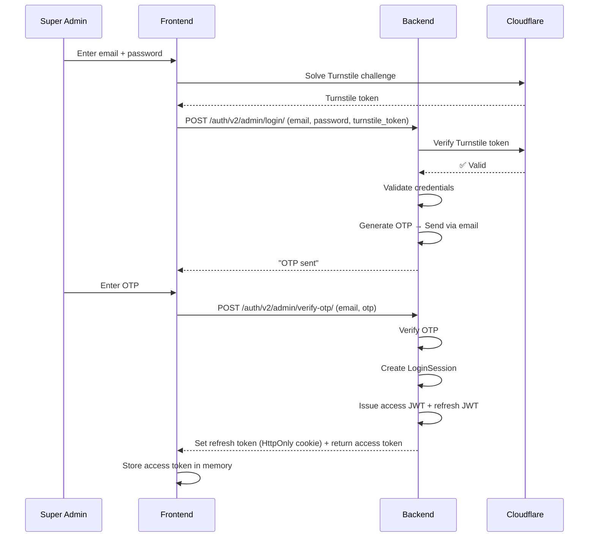
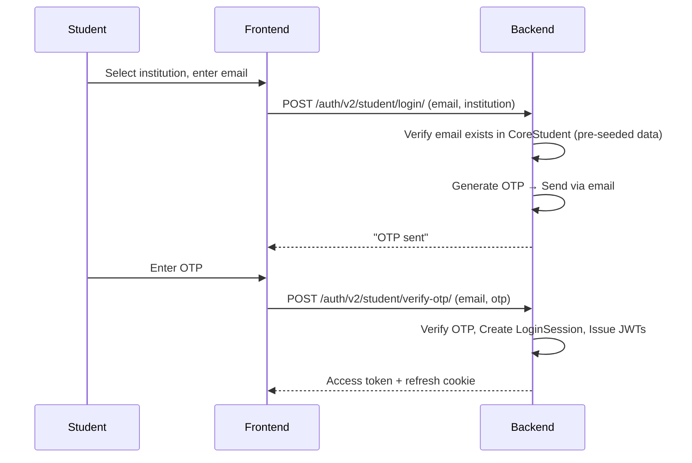

# AUIP Platform — Security & Authentication

This document covers the authentication flows, token management, session lifecycle, and defensive security measures that are **currently implemented** in the AUIP platform (Sprint 1).

---

## 1. Authentication Model

AUIP uses a **stateful JWT** model — JWTs are issued for performance, but the server retains session records for full control over invalidation.

### Token Types

| Token | Format | Lifetime | Storage | Purpose |
|-------|--------|----------|---------|---------|
| Access Token | JWT (signed) | 5 minutes | In-memory (frontend state) | Authorizes API requests |
| Refresh Token | JWT (signed) | 7 days | HttpOnly cookie | Renews access tokens silently |

### Why Stateful JWT?

Pure stateless JWTs cannot be revoked. AUIP stores session records (`LoginSession` model) on the server, allowing:
- Immediate session invalidation on logout
- Device-specific session management ("log out from all devices")
- Detection of concurrent sessions

---

## 2. Login Flows

### 2a. Super Admin Login



**Key files:**
- Frontend: [SuperAdminLogin.tsx](file:///c:/Manohar/AUIP/AUIP-Platform/frontend/src/features/auth/pages/SuperAdminLogin.tsx)
- Backend: [admin_auth_views.py](file:///c:/Manohar/AUIP/AUIP-Platform/backend/apps/identity/views/admin_auth_views.py)
- Token service: [token_service.py](file:///c:/Manohar/AUIP/AUIP-Platform/backend/apps/identity/services/token_service.py)

### 2b. Student Login (OTP-based, Passwordless)



**Key files:**
- Frontend: [StudentLogin.tsx](file:///c:/Manohar/AUIP/AUIP-Platform/frontend/src/features/auth/pages/StudentLogin.tsx)
- OTP utility: [otp_utils.py](file:///c:/Manohar/AUIP/AUIP-Platform/backend/apps/identity/utils/otp_utils.py)

---

## 3. Token Lifecycle

### Access Token Refresh (Silent Refresh)

The frontend uses **silent refresh** to seamlessly renew access tokens before they expire:

1. `useSilentRefresh.ts` runs a timer based on the access token's expiry.
2. Before the token expires, it sends a request with the HttpOnly refresh cookie.
3. The backend validates the refresh token, issues a new access token, and rotates the refresh token.
4. If the refresh token is invalid or expired, the user is logged out.

**Key file:** [useSilentRefresh.ts](file:///c:/Manohar/AUIP/AUIP-Platform/frontend/src/features/auth/hooks/useSilentRefresh.ts)

### Token Blacklisting

When a user logs out or a session is invalidated:
1. The access token's JTI (unique ID) is stored in `BlacklistedAccessToken`.
2. Token hashes are stored using HMAC (not plaintext) via `security.py`.
3. The `JWTAuthenticationMiddleware` checks the blacklist on every request.

**Key files:**
- Model: [auth_models.py](file:///c:/Manohar/AUIP/AUIP-Platform/backend/apps/identity/models/auth_models.py) → `BlacklistedAccessToken`
- Middleware: [middleware.py](file:///c:/Manohar/AUIP/AUIP-Platform/backend/apps/identity/middleware.py)

---

## 4. Session Management

### LoginSession Model

Every login creates a `LoginSession` record that tracks:

| Field | Purpose |
|-------|---------|
| `jti` | Unique identifier for the access token |
| `refresh_jti` | Unique identifier for the refresh token |
| `token_hash` | HMAC hash of the access token (for verification) |
| `device_fingerprint` | Client-generated device fingerprint |
| `device_type` | `mobile` / `desktop` / `tablet` |
| `browser_info` | Browser name and version |
| `ip_address` | Client IP address |
| `user_agent` | Full user-agent string |
| `is_active` | Whether the session is still valid |
| `expires_at` | When the session expires |
| `last_active` | Last activity timestamp |

### WebSocket Session Sync

Active sessions are monitored via WebSocket (`consumers.py`). When a session is invalidated remotely (e.g., "log out from all devices"), the frontend receives a real-time notification via the WebSocket connection managed in `useSessionSocket.ts`.

---

## 5. Defensive Security Measures

### 5a. Cloudflare Turnstile (Bot Protection)

All public-facing auth endpoints are protected by Cloudflare Turnstile:

1. The frontend renders a `TurnstileWidget` component that issues a challenge.
2. The resulting token is sent with the form submission.
3. The backend calls `verify_turnstile_token()` which validates the token with Cloudflare's API.
4. If `TURNSTILE_ENABLED=False` in settings, the check is skipped (development mode).

**Key files:**
- Frontend: [TurnstileWidget.tsx](file:///c:/Manohar/AUIP/AUIP-Platform/frontend/src/features/auth/components/TurnstileWidget.tsx)
- Backend: [turnstile.py](file:///c:/Manohar/AUIP/AUIP-Platform/backend/apps/identity/utils/turnstile.py)

### 5b. Brute-Force Protection

The `brute_force_service.py` implements rate limiting using Redis:

- Tracks failed login attempts per email.
- Locks the account after a configurable number of failures.
- Lockout duration increases with repeated failures.

**Key file:** [brute_force_service.py](file:///c:/Manohar/AUIP/AUIP-Platform/backend/apps/identity/services/brute_force_service.py)

### 5c. Content Security Policy (CSP)

The `CSPMiddleware` sets strict HTTP headers on every response:

```python
# Simplified view of the CSP directives (from middleware_csp.py)
"default-src": ["'self'", "https:"]
"script-src":  ["'self'", "'unsafe-inline'", "https://challenges.cloudflare.com"]
"frame-src":   ["'self'", "https://challenges.cloudflare.com"]
"connect-src": ["'self'", "ws://localhost:8000", "http://localhost:8000"]
```

**Key file:** [middleware_csp.py](file:///c:/Manohar/AUIP/AUIP-Platform/backend/apps/identity/middleware_csp.py)

### 5d. HMAC Token Hashing

Tokens stored in the database are **never stored in plaintext**. The `security.py` utility provides:

- `hash_token(token)` — HMAC-SHA256 based hash.
- `hash_token_secure(token)` — Additional security layer for refresh tokens.
- Key rotation support via `SEC_HMAC_K1`, `SEC_HMAC_K2`, and `SEC_HMAC_CURRENT_KEYID` in `.env`.

**Key file:** [security.py](file:///c:/Manohar/AUIP/AUIP-Platform/backend/apps/identity/utils/security.py)

### 5e. Password Reset Security

- Reset tokens are **single-use** and time-limited (24 hours).
- Token hashes are stored, not raw tokens.
- When a new reset is requested, all previous tokens for that user are invalidated.
- Expired/used links show an "Expired Link" page with a prompt to request a new one.

**Key files:**
- Model: [core_models.py](file:///c:/Manohar/AUIP/AUIP-Platform/backend/apps/identity/models/core_models.py) → `PasswordResetRequest`
- Service: [reset_service.py](file:///c:/Manohar/AUIP/AUIP-Platform/backend/apps/identity/services/reset_service.py)

### 5f. Remembered Devices (Adaptive 2FA)

The `RememberedDevice` model tracks devices that a user has previously authenticated from. This allows the system to:
- Skip OTP for trusted devices (adaptive 2FA).
- Track device hashes, IP addresses, and geolocation data.

**Key file:** [auth_models.py](file:///c:/Manohar/AUIP/AUIP-Platform/backend/apps/identity/models/auth_models.py) → `RememberedDevice`

---

## 6. Role-Based Access Control (RBAC)

### Defined Roles

| Role Constant | Display Name | Scope |
|---------------|-------------|-------|
| `SUPER_ADMIN` | Super Admin | Full platform access |
| `INST_ADMIN` | Institution Admin | Scoped to their institution's schema |
| `ADMIN` | Admin | General admin |
| `TEACHER` | Teacher | Department-scoped |
| `STUDENT` | Student | Self-service only |

### Permission Enforcement

Permissions are enforced via custom DRF permission classes in [permissions.py](file:///c:/Manohar/AUIP/AUIP-Platform/backend/apps/identity/permissions.py):

- `IsSuperAdmin` — Only `SUPER_ADMIN` role.
- `IsInstitutionAdmin` — Only `INST_ADMIN` role.
- `IsAuthenticated` — Any authenticated user.

The `JWTAuthenticationMiddleware` in [middleware.py](file:///c:/Manohar/AUIP/AUIP-Platform/backend/apps/identity/middleware.py) extracts the JWT from the `Authorization` header, validates it, checks the blacklist, and attaches the user to `request.user`.
