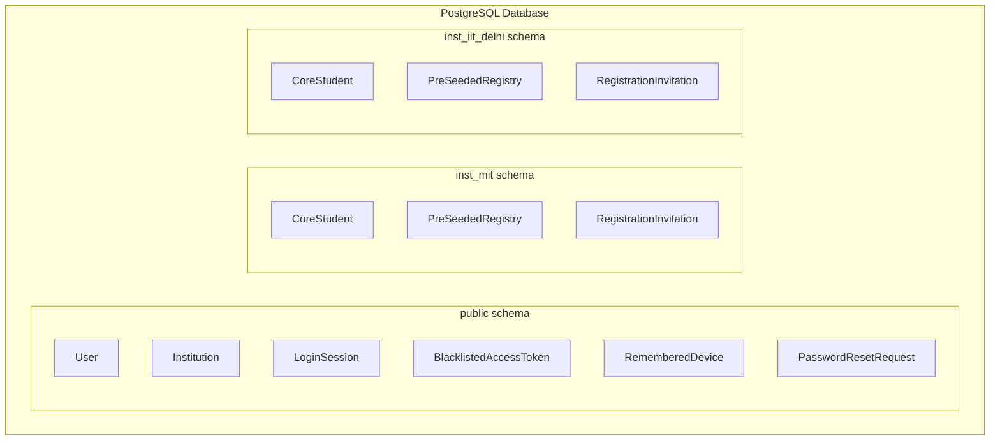
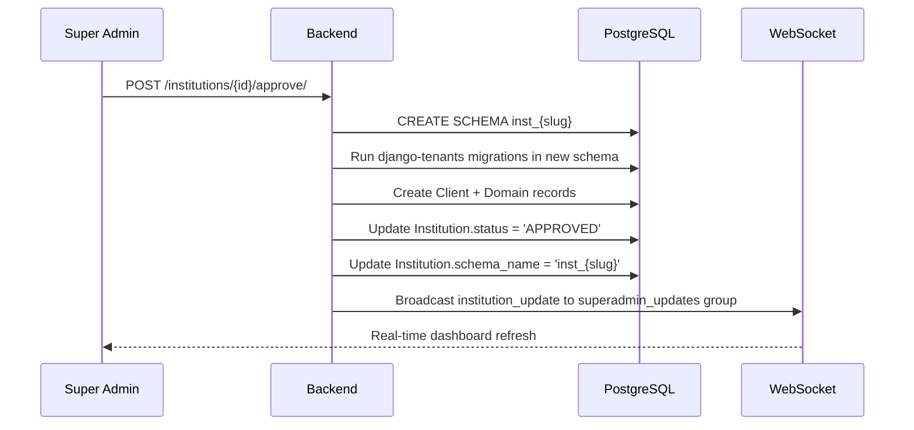

# AUIP Platform — Multi-Tenancy & Data Isolation

This document explains how the AUIP platform isolates data between institutions using PostgreSQL schema-based multi-tenancy.

---

## 1. Architecture: One Schema Per Institution

AUIP uses **PostgreSQL schema isolation** via the [django-tenants](https://django-tenants.readthedocs.io/) library. When an institution is approved, a dedicated PostgreSQL schema is created for it. All institution-scoped data lives exclusively within that schema.



### Schema Naming Convention

Every institution gets a schema named `inst_<slug>`, where `slug` is derived from the institution name:

```
MIT → inst_mit
IIT Delhi → inst_iit_delhi
Stanford University → inst_stanford_university
```

---

## 2. Shared vs Tenant Models

| Scope | Where | Models | Django-Tenants Type |
|-------|-------|--------|---------------------|
| **Shared** (public schema) | `SHARED_APPS` | `User`, `Institution`, `LoginSession`, `BlacklistedAccessToken`, `RememberedDevice`, `PasswordResetRequest`, `InstitutionAdmin`, `RegistrationInvitation`, `Client`, `Domain` | `django_tenants.models.TenantMixin` |
| **Tenant** (inst_* schema) | `TENANT_APPS` | `CoreStudent`, `StudentProfile`, `TeacherProfile`, `PreSeededRegistry`, `Subject`, `Course`, `Batch`, `Quiz`, `Attempt`, placement data | Regular Django models |

### Key Relationship

The `User` model (shared) links to `CoreStudent` (tenant) via `stu_ref`:

```python
# In public schema
class User(AbstractUser):
    core_student = models.ForeignKey("CoreStudent", null=True, blank=True)
    institution = models.ForeignKey("Institution", null=True, blank=True)
    role = models.CharField(choices=ROLE_CHOICES)
```

When accessing tenant data, the application uses `schema_context()` to switch schemas:

```python
from apps.identity.utils.multitenancy import schema_context

with schema_context("inst_mit"):
    students = CoreStudent.objects.filter(department="CS")
    # This SQL query runs against the inst_mit schema
```

---

## 3. Tenant Provisioning Flow

When a Super Admin approves an institution registration:



### Implementation: [multitenancy.py](file:///c:/Manohar/AUIP/AUIP-Platform/backend/apps/identity/utils/multitenancy.py)

```python
def create_institution_schema(institution):
    """
    1. Generate slug from institution name
    2. CREATE SCHEMA inst_<slug>
    3. Run tenant migrations
    4. Create Client + Domain entries
    5. Update institution record with schema_name
    """
```

---

## 4. Django-Tenants Configuration

From [base.py](file:///c:/Manohar/AUIP/AUIP-Platform/backend/auip_core/settings/base.py):

```python
DATABASES = {
    "default": {
        "ENGINE": "django_tenants.postgresql_backend",
        # ... connection params
    }
}

DATABASE_ROUTERS = ("django_tenants.routers.TenantSyncRouter",)

TENANT_MODEL = "auip_tenant.Client"
TENANT_DOMAIN_MODEL = "auip_tenant.Domain"

SHARED_APPS = [
    "django_tenants",
    "apps.auip_tenant",
    "apps.identity",
    "rest_framework",
    # ...
]

TENANT_APPS = [
    "apps.auip_institution",
    "apps.academic",
    "apps.quizzes",
    "apps.attempts",
    "apps.anti_cheat",
    # ...
]

INSTALLED_APPS = list(SHARED_APPS) + [app for app in TENANT_APPS if app not in SHARED_APPS]
```

---

## 5. Tenant Models

### Client Model (auip_tenant/models.py)

```python
from django_tenants.models import TenantMixin, DomainMixin

class Client(TenantMixin):
    name = models.CharField(max_length=100)
    is_active = models.BooleanField(default=True)
    created_on = models.DateField(auto_now_add=True)
    auto_create_schema = True

class Domain(DomainMixin):
    pass
```

### PreSeededRegistry (auip_institution/models.py)

The tenant-side model for pre-seeded student identities:

```python
class PreSeededRegistry(models.Model):
    stu_ref = models.CharField(max_length=50, unique=True, primary_key=True)
    roll_number = models.CharField(max_length=20)
    full_name = models.CharField(max_length=200)
    email = models.EmailField()
    department = models.CharField(max_length=100)
    batch_year = models.IntegerField()
    cgpa = models.DecimalField(max_digits=4, decimal_places=2)
    tenth_percent = models.DecimalField(...)
    twelfth_percent = models.DecimalField(...)
    status = models.CharField(choices=['SEEDED', 'INVITED', 'VERIFIED', 'ACTIVE'])
```

---

## 6. Security Guarantees

| Guarantee | How It's Enforced |
|-----------|------------------|
| **No cross-tenant data access** | PostgreSQL `SET search_path TO inst_<slug>` — queries physically cannot reach other schemas |
| **Schema creation requires Super Admin approval** | `InstitutionRegistrationView` only creates the `Institution` record; schema is created only on approval |
| **Schema name is deterministic** | Derived from institution slug — no user-controlled input in schema names |
| **Tenant context is explicit** | All tenant-scoped operations require `schema_context()` wrapper |
| **Django-tenants routing** | `TenantSyncRouter` ensures migrations only run in the correct schema |

---

## 7. Real-Time Institutional Hub

When any `Institution` record is created, updated, or deleted, Django signals broadcast the change to all connected Super Admin WebSocket clients:

**Signals:** [signals.py](file:///c:/Manohar/AUIP/AUIP-Platform/backend/apps/identity/signals.py)

```python
@receiver(post_save, sender=Institution)
def broadcast_institution_change(sender, instance, created, **kwargs):
    channel_layer = get_channel_layer()
    async_to_sync(channel_layer.group_send)(
        "superadmin_updates",
        {
            "type": "institution_update",
            "data": {
                "id": instance.id,
                "name": instance.name,
                "status": instance.status,
                "action_type": "registration" if created else "update"
            }
        }
    )
```

The `SessionConsumer` relays these events to the Super Admin dashboard for real-time updates without manual page refresh.
