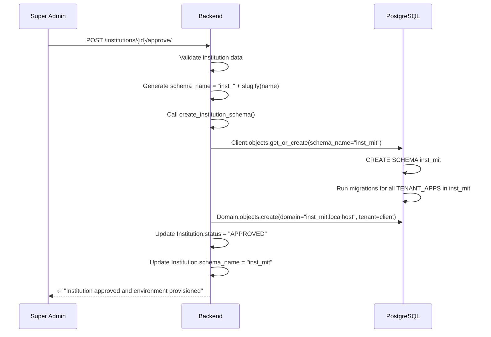

# AUIP Platform — Multi-Tenancy & Data Isolation

This document explains how AUIP isolates data between institutions at the database level.

---

## 1. The Problem

AUIP is designed to serve **multiple universities** on a single deployment. Without isolation, Institution A could accidentally (or maliciously) access Institution B's student data. Traditional approaches like row-level filtering (`WHERE institution_id = X`) are fragile and error-prone.

---

## 2. The Solution — PostgreSQL Schema Isolation

AUIP uses **PostgreSQL schemas** to isolate tenant data. Each approved institution gets its own database schema, which acts as a separate namespace within the same PostgreSQL database.

```
PostgreSQL Database: auip_db
├── public (schema)           — Shared data (institutions, super admin users, platform config)
├── inst_mit (schema)         — MIT's isolated data (students, faculty, courses)
├── inst_harvard (schema)     — Harvard's isolated data
└── inst_stanford (schema)    — Stanford's isolated data
```

### Why Schemas (Not Separate Databases)?

| Approach | Pros | Cons |
|----------|------|------|
| Row-level filtering (`WHERE inst_id=X`) | Simple, single schema | Fragile; one missing filter leaks data |
| Separate databases per tenant | Maximum isolation | Hard to manage migrations, expensive |
| **PostgreSQL schemas** ✅ | Strong isolation, shared migrations, single DB connection | Slightly more complex setup |

---

## 3. How It Works

### 3a. Technology: `django-tenants`

AUIP uses the [django-tenants](https://django-tenants.readthedocs.io/) library, which provides:
- Automatic schema creation when a new tenant (institution) is created.
- Automatic migration of tenant-specific apps into each schema.
- Middleware for routing requests to the correct schema.

### 3b. Tenant Models

The tenant system is defined in two Django apps:

**`auip_tenant/models.py`** — The `Client` and `Domain` models:

```python
# Simplified from backend/apps/auip_tenant/models.py
from django_tenants.models import TenantMixin, DomainMixin

class Client(TenantMixin):
    name = models.CharField(max_length=100)
    auto_create_schema = True  # Automatically creates schema on Client.save()

class Domain(DomainMixin):
    pass  # Associates domain names with Client records
```

**`auip_institution/models.py`** — Pre-seeded registry for tenant apps:

```python
# Simplified from backend/apps/auip_institution/models.py
class PreSeededRegistry(models.Model):
    """Tracks seeded student data per institution schema."""
    institution_name = models.CharField(max_length=255)
    schema_name = models.CharField(max_length=63)
    # ...
```

### 3c. App Routing

In `settings/base.py`, apps are classified as either **shared** (in the `public` schema) or **tenant-specific** (replicated into each institution's schema):

| Category | Apps | Schema |
|----------|------|--------|
| **Shared** | `identity`, `auip_tenant`, Django core apps | `public` |
| **Tenant** | `academic`, `auip_institution`, examination apps | `inst_<slug>` |

---

## 4. Schema Provisioning Flow

When a Super Admin approves an institution, the following happens:



### Key Utility: `create_institution_schema()`

Located in [multitenancy.py](file:///c:/Manohar/AUIP/AUIP-Platform/backend/apps/identity/utils/multitenancy.py):

```python
def create_institution_schema(schema_name, name=None, domain=None):
    """
    Creates a new Tenant (Client) and Domain using django-tenants.
    This triggers automatic schema creation and migration of all TENANT_APPS.
    """
    schema_name = "".join(c for c in schema_name if c.isalnum() or c == "_").lower()

    client, created = Client.objects.get_or_create(
        schema_name=schema_name,
        defaults={'name': name or schema_name}
    )

    if created:
        final_domain = domain or f"{schema_name}.localhost"
        Domain.objects.get_or_create(
            domain=final_domain, tenant=client,
            defaults={'is_primary': True}
        )
    return created
```

### Key Utility: `schema_context()`

For code that needs to operate within a specific institution's schema:

```python
from apps.identity.utils.multitenancy import schema_context

# All database operations inside this block
# will target the 'inst_mit' schema
with schema_context('inst_mit'):
    students = CoreStudent.objects.all()  # Only MIT's students
```

---

## 5. Security Guarantees

| Guarantee | How It's Enforced |
|-----------|-------------------|
| No cross-tenant data access | PostgreSQL `search_path` is set per-request |
| Schema names are sanitized | `create_institution_schema()` strips non-alphanumeric characters |
| Shared data is read-only for tenants | Shared apps live in `public` schema; tenants cannot modify them |
| Automatic migration | New schemas receive all tenant app tables via `django-tenants` |

---

## 6. Files Involved

| File | Path | Purpose |
|------|------|---------|
| `multitenancy.py` | [backend/apps/identity/utils/multitenancy.py](file:///c:/Manohar/AUIP/AUIP-Platform/backend/apps/identity/utils/multitenancy.py) | `create_institution_schema()`, `schema_context()` |
| `Client` model | [backend/apps/auip_tenant/models.py](file:///c:/Manohar/AUIP/AUIP-Platform/backend/apps/auip_tenant/models.py) | django-tenants TenantMixin |
| `Institution` model | [backend/apps/identity/models/institution.py](file:///c:/Manohar/AUIP/AUIP-Platform/backend/apps/identity/models/institution.py) | Approval status, schema_name reference |
| `institution_views.py` | [backend/apps/identity/views/admin/institution_views.py](file:///c:/Manohar/AUIP/AUIP-Platform/backend/apps/identity/views/admin/institution_views.py) | Approve/reject actions with schema creation |
| `settings/base.py` | [backend/auip_core/settings/base.py](file:///c:/Manohar/AUIP/AUIP-Platform/backend/auip_core/settings/base.py) | `SHARED_APPS`, `TENANT_APPS` configuration |
