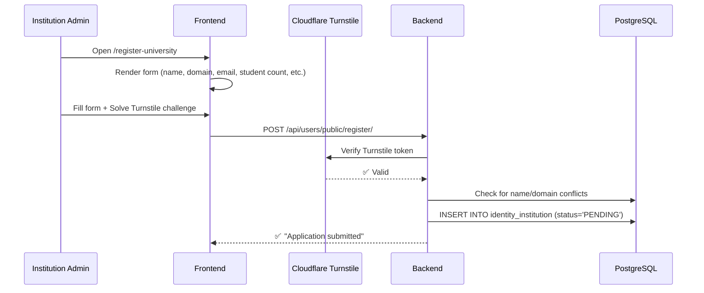
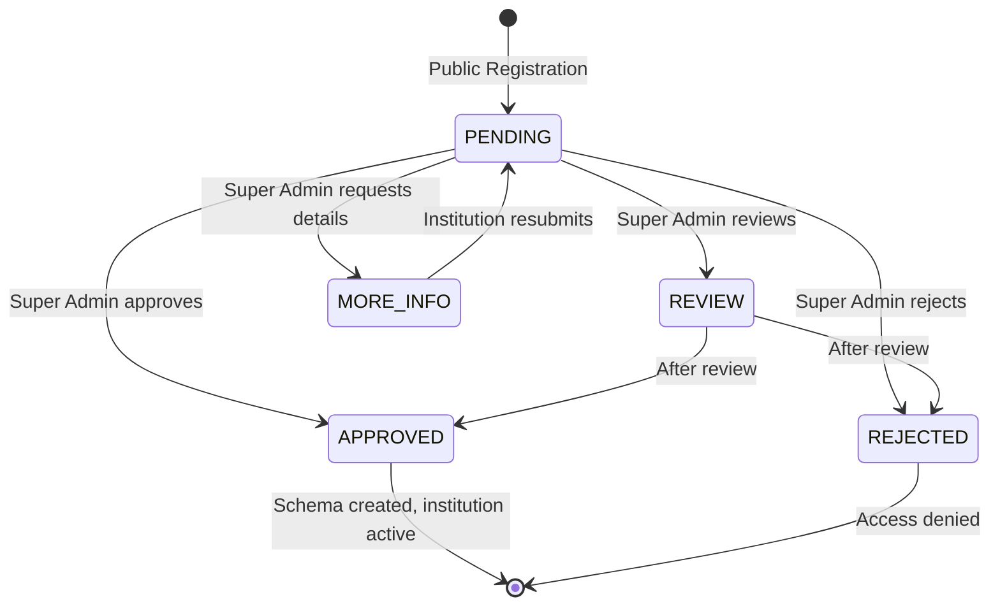
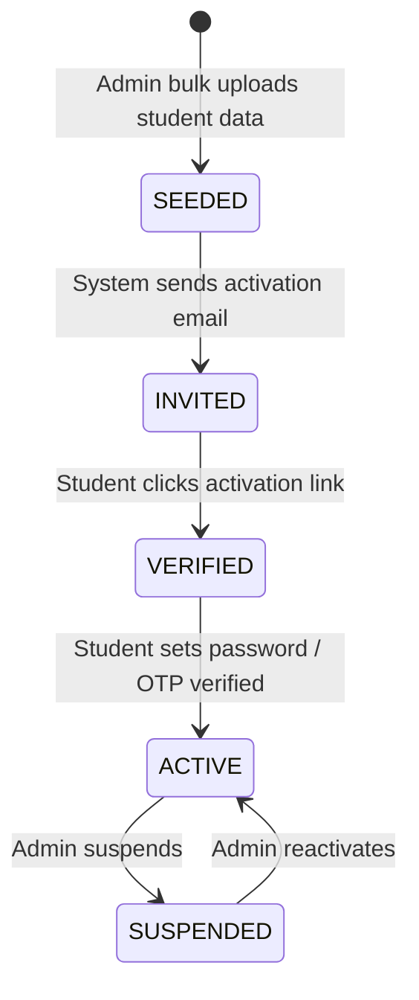

# AUIP Platform — Registration & Onboarding Lifecycle

This document covers the complete lifecycle from institution registration through student activation. It references the design philosophy from `project_document.txt` and the actual implementation.

---

## 1. Core Philosophy

> **Seeding ≠ Invitation ≠ Verification ≠ Activation ≠ Login**

These are five distinct states in AUIP. In traditional systems, registration immediately creates an account and allocates resources. AUIP delays resource allocation until the student proves intent by activating their account.

---

## 2. Institution Registration & Approval

### 2a. Public Registration (Anyone Can Apply)



#### What Gets Stored

The `Institution` model stores:

| Field | Example Value | Purpose |
|-------|---------------|---------|
| `name` | "MIT" | Display name |
| `slug` | "mit" | URL-safe identifier |
| `domain` | "mit.edu" | Email domain for validation |
| `contact_email` | "admin@mit.edu" | Primary contact |
| `student_count_estimate` | 5000 | For capacity planning |
| `registration_data` | `{...}` (JSON) | Full application data |
| `status` | `PENDING` | Lifecycle state |
| `schema_name` | `null` (until approved) | PostgreSQL schema reference |

**Frontend:** [RegisterUniversity.tsx](file:///c:/Manohar/AUIP/AUIP-Platform/frontend/src/features/auth/pages/RegisterUniversity.tsx)
**Backend:** [registration.py](file:///c:/Manohar/AUIP/AUIP-Platform/backend/apps/identity/views/public/registration.py)

### 2b. Institution Lifecycle States



### 2c. Super Admin Approval Flow

When a Super Admin clicks "Approve" in the Institution Hub:

1. Backend validates the institution record.
2. A schema name is generated: `inst_` + slugified institution name.
3. `create_institution_schema()` creates a new PostgreSQL schema.
4. `django-tenants` runs all tenant app migrations into the new schema.
5. The institution's `status` is updated to `APPROVED`.
6. The institution's `schema_name` is saved.

**Frontend:** [InstitutionAdmin.tsx](file:///c:/Manohar/AUIP/AUIP-Platform/frontend/src/features/dashboard/pages/InstitutionAdmin.tsx)
**Backend:** [institution_views.py](file:///c:/Manohar/AUIP/AUIP-Platform/backend/apps/identity/views/admin/institution_views.py)

---

## 3. Student Onboarding (Designed, Partially Implemented)

> [!IMPORTANT]
> The student lifecycle described below is the **designed** flow based on `project_document.txt` and `authentication-architecture.md`. The backend models (`CoreStudent`, `RegistrationInvitation`) are implemented, but the complete end-to-end bulk seeding and activation workflow is still being wired up in Sprint 2.

### 3a. Identity State Machine



### 3b. Step-by-Step Flow

#### Step 1: Pre-Seeding (Institution Admin)

The institutional admin uploads student data via CSV/Excel. For each valid entry, the system creates a `CoreStudent` record:

```
STU_REF:            STU_2025_0142
Email:              abc@college.edu
Identity State:     SEEDED
Registration Status: NOT_REGISTERED
```

**No user account is created.** No resources are allocated. Seeding only establishes an institution-recognized identity.

**Model:** [core_models.py](file:///c:/Manohar/AUIP/AUIP-Platform/backend/apps/identity/models/core_models.py) → `CoreStudent`

#### Step 2: Invitation (Automated)

After seeding, the system sends activation emails to each seeded student. A `RegistrationInvitation` record is created with:
- A unique, cryptographically secure activation token.
- An expiry time (7 days).
- Status tracking (`PENDING` → `ACTIVATED` → `EXPIRED`).

**Model:** [invitation.py](file:///c:/Manohar/AUIP/AUIP-Platform/backend/apps/identity/models/invitation.py) → `RegistrationInvitation`

#### Step 3: Identity Confirmation (Student)

The student clicks the activation link or enters their institutional email on the portal. The system checks:
- Does the email map to a `CoreStudent.stu_ref`?
- If NO → "No account found. Contact your institution."
- If YES → Proceed to activation.

#### Step 4: Verification & Activation

The student verifies via OTP or secure link. Upon success:
1. A `User` record is created in `auth_users`.
2. A `StudentProfile` record is created and linked to the `CoreStudent`.
3. `CoreStudent.status` transitions to `ACTIVE`.
4. Dashboard and services are provisioned.

**Service:** [activation_service.py](file:///c:/Manohar/AUIP/AUIP-Platform/backend/apps/identity/services/activation_service.py)

#### Step 5: Login (Post-Activation)

Activated students log in via **OTP-based passwordless auth**:
1. Enter email → System resolves to `STU_REF`.
2. OTP sent to email.
3. OTP verified → JWT issued → Dashboard access.

---

## 4. The `CoreStudent` Model

This is the institution-controlled student record. Students **cannot modify** this data — it is the authoritative source of truth for academic information.

| Field | Type | Description |
|-------|------|-------------|
| `stu_ref` | CharField (PK) | System-generated reference (e.g., "2021-CS-001") |
| `roll_number` | CharField (unique) | Institution roll number |
| `full_name` | CharField | Student's full name |
| `department` | CharField | Department/branch |
| `batch_year` | IntegerField | Year of admission |
| `official_email` | EmailField (unique) | Institution email |
| `cgpa` | DecimalField | Current CGPA |
| `tenth_percentage` | DecimalField | 10th grade percentage |
| `twelfth_percentage` | DecimalField | 12th grade percentage |
| `current_semester` | IntegerField | Current semester number |
| `attendance_percentage` | DecimalField | Attendance percentage |
| `status` | CharField | `SEEDED` / `INVITED` / `VERIFIED` / `ACTIVE` / `SUSPENDED` |
| `institution` | ForeignKey | Link to the `Institution` model |
| `is_eligible_for_placement` | BooleanField | Placement eligibility flag |

---

## 5. Why This Design Matters

| Old Way | AUIP Way |
|---------|----------|
| Student registers → account created immediately | Student invited → activates only if interested |
| Resources wasted on 1000 accounts, 300 active | Resources allocated only for 300 active students |
| Email = identity (fragile) | STU_REF = identity (institution-owned, stable) |
| Admin has no visibility into dormant accounts | Admin dashboard shows `SEEDED` vs `ACTIVE` vs `INACTIVE` |
| No institutional control over registration | Only institution-approved identities can register |

---

## 6. Files Summary

| File | Purpose |
|------|---------|
| [core_models.py](file:///c:/Manohar/AUIP/AUIP-Platform/backend/apps/identity/models/core_models.py) | `CoreStudent`, `User`, `StudentProfile`, `TeacherProfile` |
| [institution.py](file:///c:/Manohar/AUIP/AUIP-Platform/backend/apps/identity/models/institution.py) | `Institution`, `InstitutionAdmin` |
| [invitation.py](file:///c:/Manohar/AUIP/AUIP-Platform/backend/apps/identity/models/invitation.py) | `RegistrationInvitation` |
| [registration.py](file:///c:/Manohar/AUIP/AUIP-Platform/backend/apps/identity/views/public/registration.py) | Public institution registration endpoint |
| [institution_views.py](file:///c:/Manohar/AUIP/AUIP-Platform/backend/apps/identity/views/admin/institution_views.py) | Approve/reject/review institution |
| [activation_service.py](file:///c:/Manohar/AUIP/AUIP-Platform/backend/apps/identity/services/activation_service.py) | Student account activation logic |
| [multitenancy.py](file:///c:/Manohar/AUIP/AUIP-Platform/backend/apps/identity/utils/multitenancy.py) | Schema creation on approval |
| [RegisterUniversity.tsx](file:///c:/Manohar/AUIP/AUIP-Platform/frontend/src/features/auth/pages/RegisterUniversity.tsx) | Public registration form |
| [InstitutionAdmin.tsx](file:///c:/Manohar/AUIP/AUIP-Platform/frontend/src/features/dashboard/pages/InstitutionAdmin.tsx) | Super Admin institution management |
| [CoreStudentAdmin.tsx](file:///c:/Manohar/AUIP/AUIP-Platform/frontend/src/features/dashboard/pages/CoreStudentAdmin.tsx) | Student data management UI |
