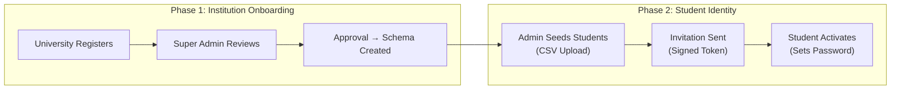
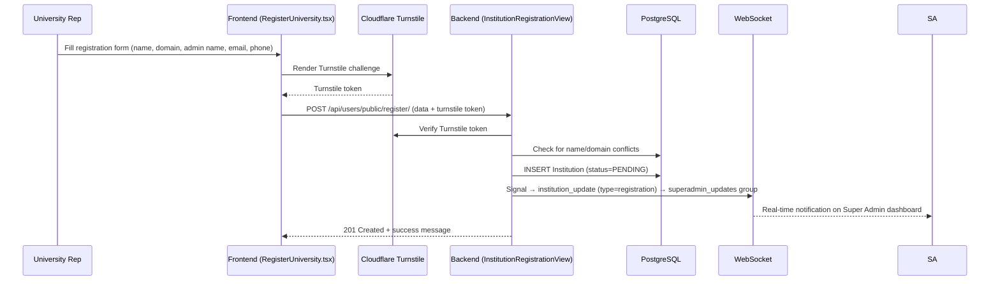
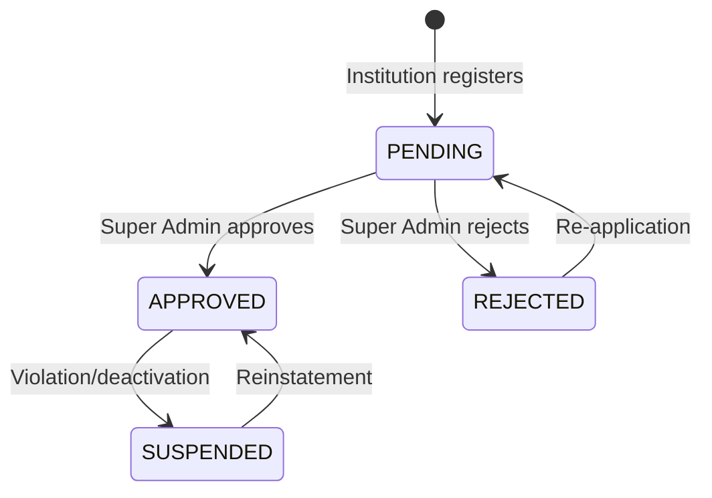
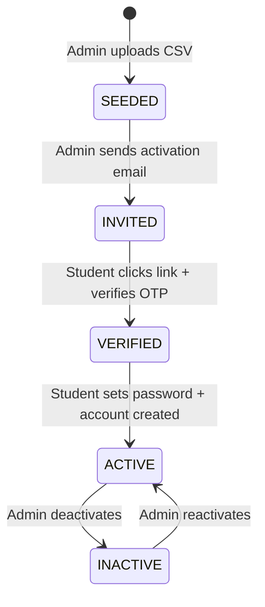
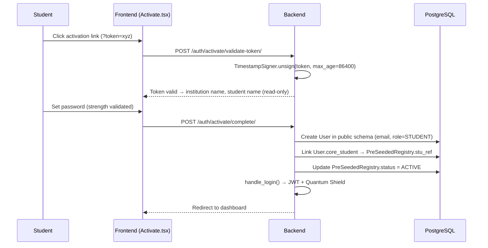
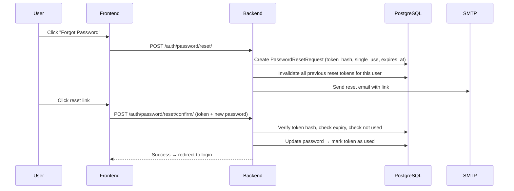

# AUIP Platform — Registration & Onboarding Lifecycle

This document covers the full lifecycle from **institutional registration** through **student identity provisioning** to **account activation**.

---

## 1. Overview: The Two-Phase Identity Model

AUIP's identity model is fundamentally different from typical platforms. There is no "Sign Up" button for students. Identity flows through two controlled phases:



---

## 2. Institution Registration & Approval

### 2a. Public Registration (Turnstile-Protected)

When a university representative visits the registration page:



**Registration data stored in the `Institution` model:**

| Field | Example |
|-------|---------|
| `name` | "MIT Pune" |
| `domain` | "mitpune.edu.in" |
| `slug` | "mit-pune" |
| `status` | "PENDING" |
| `registration_data` (JSON) | Admin name, email, phone, designation |
| `schema_name` | NULL (until approved) |

### 2b. Super Admin Review & Approval

The Super Admin dashboard (`InstitutionAdmin.tsx`) shows all institutions with their status:



**On Approval:**

1. `create_institution_schema(institution)` is called
2. PostgreSQL: `CREATE SCHEMA inst_<slug>`
3. Django-tenants runs all `TENANT_APPS` migrations in the new schema
4. `Client` and `Domain` records are created
5. `Institution.schema_name` is updated
6. WebSocket broadcasts the status change to all connected Super Admins

---

## 3. Student Identity Lifecycle

Students go through a 4-state lifecycle within their institution's tenant schema:



### 3a. Seeding (CSV Upload)

The Admin/SPOC uploads a CSV file containing student records:

| CSV Column | Maps To | Required |
|------------|---------|----------|
| stu_ref | `PreSeededRegistry.stu_ref` | ✅ |
| roll_number | `PreSeededRegistry.roll_number` | ✅ |
| full_name | `PreSeededRegistry.full_name` | ✅ |
| department | `PreSeededRegistry.department` | ✅ |
| email | `PreSeededRegistry.email` | ✅ |
| batch_year | `PreSeededRegistry.batch_year` | ✅ |
| cgpa | `PreSeededRegistry.cgpa` | ❌ |
| tenth_percent | `PreSeededRegistry.tenth_percent` | ❌ |
| twelfth_percent | `PreSeededRegistry.twelfth_percent` | ❌ |

Each record is created with `status = SEEDED`. No `User` account, no `LoginSession`, no resources allocated.

### 3b. Activation Invitation

When the Admin selects students and sends invitations:

1. System generates a **signed activation token** using Django's `TimestampSigner`:

```python
# activation.py
signer = TimestampSigner(salt="activation-salt")

def generate_activation_token(institution_id, identifier, role):
    data = f"{institution_id}:{identifier}:{role}"
    return signer.sign(data)
```

2. The token encodes: `institution_id:stu_ref:role`
3. An email is sent with the activation URL: `{FRONTEND_URL}/auth/activate?token=<signed_token>`
4. Student status: `SEEDED → INVITED`
5. Token is time-limited (default: 24 hours)

### 3c. Student Activation

When the student clicks the activation link:



### Why This Design?

| Design Choice | Rationale |
|---------------|-----------|
| **No self-registration** | Prevents phantom accounts. Institution controls who can join. |
| **Pre-seeded identity** | `STU_REF` is the canonical identifier, set by the institution. |
| **Resources allocated post-activation only** | `User`, `LoginSession`, Quantum Shield cookies — all created only when a student actually activates. |
| **Signed tokens** | Django `TimestampSigner` provides cryptographic integrity + time-based expiry. No random tokens stored in the DB. |

---

## 4. OTP Flows for Account Operations

Two OTP paths are implemented:

### User-Based OTP (Existing Users)

Used for Super Admin login MFA and student login:

```python
# send_otp_secure(user)
otp = generate_otp()  # 6-digit via secrets.randbelow()
key = make_cache_key("otp", str(user.id), ip="SEC_GATE")
cache_set(key, hash_token_secure(otp), timeout=OTP_TTL_SECONDS)
send_otp_to_user(user, otp)
```

### Identifier-Based OTP (Pre-Activation)

Used when a student hasn't activated yet and there's no `User` object:

```python
# send_otp_to_identifier(identifier, email)
otp = generate_otp()
key = make_cache_key("otp", str(identifier), ip="SEC_GATE")
cache_set(key, hash_token_secure(otp), timeout=OTP_TTL_SECONDS)
send_mail("Your Verification Code", f"Code: {otp}", settings.DEFAULT_FROM_EMAIL, [email])
```

Both paths:
- Store OTPs as **HMAC hashes** in Redis (never plaintext)
- Delete cache entry after successful verification (single-use)
- Log OTP values in debug mode only

---

## 5. Password Reset Flow



Key security properties:
- Token is hashed using `hash_token_secure()` before storage
- New request **invalidates all existing tokens** for the user
- Tokens expire after configurable TTL (default 24 hours)
- Used tokens are marked → cannot be reused
- "Expired Link" page shown if token is invalid/used
