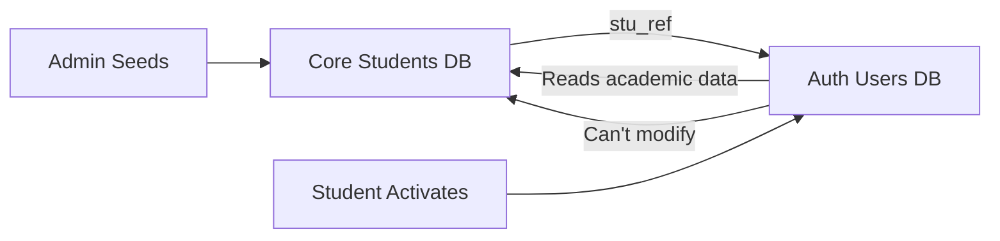

# AUIP Platform - Authentication & Identity Architecture

## Overview

AUIP uses a **two-database architecture** for student identity management with **activation link-based registration** instead of OTP. This follows industry best practices for separation of concerns and data security.

---

## Architecture Principle

> **Separation of Core Academic Data from Authentication Data**

This ensures:
- ✅ Core student records remain immutable and controlled by institution
- ✅ Authentication/access management is separate and flexible
- ✅ Students can't tamper with academic records
- ✅ Clear audit trail of activations and access

---

## Two-Database Architecture

### Database 1: Core Student Database (Institution-Controlled)
**Purpose**: Authoritative source of truth for student academic data

**Managed By**: University Administration, Faculty, SPOC

**Tables**:
```sql
-- Students table (pre-seeded by institution)
CREATE TABLE core_students (
    stu_ref VARCHAR(20) PRIMARY KEY,      -- Unique student reference (e.g., "2021-CS-001")
    roll_number VARCHAR(50) UNIQUE,       -- Roll number
    full_name VARCHAR(255) NOT NULL,
    department VARCHAR(100),
    batch_year INTEGER,
    
    -- Academic Details
    cgpa DECIMAL(3, 2),                   -- Current CGPA
    tenth_percentage DECIMAL(5, 2),       -- 10th grade %
    twelfth_percentage DECIMAL(5, 2),     -- 12th grade %
    current_semester INTEGER,
    attendance_percentage DECIMAL(5, 2),
    
    -- Contact (for seeding only)
    official_email VARCHAR(255) UNIQUE,   -- @university.edu
    
    -- Metadata
    seeded_at TIMESTAMP DEFAULT NOW(),
    seeded_by VARCHAR(255),               -- Admin/SPOC who added this
    is_eligible_for_placement BOOLEAN DEFAULT FALSE,
    
    -- Status
    status VARCHAR(20) DEFAULT 'SEEDED'   -- SEEDED, INVITED, ACTIVE, SUSPENDED
);

-- Academic history (semesters, courses, grades)
CREATE TABLE core_student_semesters (
    id SERIAL PRIMARY KEY,
    stu_ref VARCHAR(20) REFERENCES core_students(stu_ref),
    semester_number INTEGER,
    sgpa DECIMAL(3, 2),
    credits_completed INTEGER,
    year INTEGER
);
```

**Key Points**:
- ✅ Pre-populated by institution before students join
- ✅ Students **cannot modify** this data
- ✅ Only admins/faculty can update academic records
- ✅ `stu_ref` is the primary key (not email, not user ID)

---

### Database 2: Authentication & Registration Database
**Purpose**: Manage user accounts, activation, and access control

**Managed By**: System (with student self-service for activation)

**Tables**:
```sql
-- User accounts (created after activation)
CREATE TABLE auth_users (
    id UUID PRIMARY KEY DEFAULT gen_random_uuid(),
    email VARCHAR(255) UNIQUE NOT NULL,   -- Can be official or personal
    username VARCHAR(150) UNIQUE,         -- Optional
    password_hash VARCHAR(255),           -- Hashed password
    
    -- Link to core database
    stu_ref VARCHAR(20) UNIQUE,           -- Links to core_students.stu_ref
    
    -- Account status
    is_active BOOLEAN DEFAULT FALSE,
    is_verified BOOLEAN DEFAULT FALSE,
    email_verified_at TIMESTAMP,
    
    -- Role
    role VARCHAR(20) DEFAULT 'STUDENT',   -- STUDENT, TPO, SPOC, ADMIN
    
    -- Timestamps
    created_at TIMESTAMP DEFAULT NOW(),
    last_login TIMESTAMP
);

-- Registration invitations (sent to students)
CREATE TABLE auth_registration_invitations (
    id UUID PRIMARY KEY DEFAULT gen_random_uuid(),
    stu_ref VARCHAR(20) REFERENCES core_students(stu_ref),
    email VARCHAR(255) NOT NULL,          -- Where to send invite
    
    -- Activation token
    activation_token VARCHAR(255) UNIQUE NOT NULL,
    token_expires_at TIMESTAMP NOT NULL,
    
    -- Status
    status VARCHAR(20) DEFAULT 'PENDING', -- PENDING, ACTIVATED, EXPIRED, REVOKED
    invited_at TIMESTAMP DEFAULT NOW(),
    activated_at TIMESTAMP,
    
    -- Metadata
    invited_by VARCHAR(255),              -- Admin who sent invite
    ip_address_on_activation INET,
    user_agent_on_activation TEXT
);

-- Session management
CREATE TABLE auth_refresh_tokens (
    id UUID PRIMARY KEY DEFAULT gen_random_uuid(),
    user_id UUID REFERENCES auth_users(id) ON DELETE CASCADE,
    token VARCHAR(255) UNIQUE NOT NULL,
    expires_at TIMESTAMP NOT NULL,
    created_at TIMESTAMP DEFAULT NOW(),
    revoked_at TIMESTAMP
);
```

---

## Registration & Activation Workflow

### Phase 1: Institution Seeds Students (Bulk Upload)
```
1. Admin/SPOC uploads Excel/CSV with student data
2. System validates data
3. System creates records in `core_students` table
4. Status: SEEDED
```

**Example CSV**:
```csv
stu_ref,roll_number,full_name,department,batch_year,official_email,cgpa,tenth_percentage,twelfth_percentage
2021-CS-001,21CS001,John Doe,Computer Science,2021,john.doe@university.edu,8.5,85.0,88.0
2021-CS-002,21CS002,Jane Smith,Computer Science,2021,jane.smith@university.edu,9.2,92.0,95.0
```

---

### Phase 2: Send Activation Invitations
```
1. TPO/Admin selects students to invite
2. System generates unique activation token for each student
3. System creates record in `auth_registration_invitations`
4. System sends email with activation link
5. Status in core_students: SEEDED → INVITED
```

**Activation Email**:
```
Subject: Activate Your AUIP Account

Hi John Doe,

Your university has invited you to join the AUIP platform.

Click the link below to activate your account:
https://auip.university.edu/activate?token=abc123xyz789

This link expires in 7 days.

Student Reference: 2021-CS-001
Email: john.doe@university.edu

---
AUIP Team
```

---

### Phase 3: Student Activates Account
```
1. Student clicks activation link
2. System validates token (not expired, not already used)
3. System shows registration form:
   - Pre-filled: Name, Email, STU_REF (read-only)
   - Student enters: Password, Confirms Password
   - Optional: Personal email (if different)
4. Student submits form
5. System:
   - Creates user in `auth_users`
   - Links to `core_students` via stu_ref
   - Marks invitation as ACTIVATED
   - Updates core_students.status: INVITED → ACTIVE
6. Student can now login
```

**Registration Form**:
```
┌─────────────────────────────────────┐
│  Activate Your AUIP Account         │
├─────────────────────────────────────┤
│  Student Reference: 2021-CS-001     │  (read-only)
│  Name: John Doe                     │  (read-only)
│  Official Email: john@university.edu│  (read-only)
│                                     │
│  Personal Email (optional):         │
│  ┌─────────────────────────────┐   │
│  │ john.personal@gmail.com     │   │
│  └─────────────────────────────┘   │
│                                     │
│  Create Password:                   │
│  ┌─────────────────────────────┐   │
│  │ ••••••••                    │   │
│  └─────────────────────────────┘   │
│                                     │
│  Confirm Password:                  │
│  ┌─────────────────────────────┐   │
│  │ ••••••••                    │   │
│  └─────────────────────────────┘   │
│                                     │
│  [ Activate Account ]               │
└─────────────────────────────────────┘
```

---

### Phase 4: Login & Access
```
1. Student goes to login page
2. Enters email + password
3. System validates credentials
4. System issues JWT access token (5 min) + refresh token (7 days)
5. Student accesses platform
```

---

## Data Flow: Core ↔ Auth Connection



**Key Principle**: 
- `auth_users.stu_ref` is a **foreign key** to `core_students.stu_ref`
- Students authenticate via `auth_users`
- Academic data is fetched via JOIN on `stu_ref`
- Students can **read** academic data but **cannot modify** it

---

## Security Benefits

### 1. Separation of Concerns
- ✅ Academic data integrity protected
- ✅ Authentication layer can be changed independently
- ✅ Different access controls for each database

### 2. Activation Link Security
- ✅ Cryptographically secure tokens (256-bit random)
- ✅ Time-limited (7 days expiry)
- ✅ One-time use (marked as ACTIVATED after use)
- ✅ Can be revoked if needed

### 3. Audit Trail
- ✅ Track who seeded each student
- ✅ Track who sent invitations
- ✅ Track when activation happened
- ✅ Track IP address & user agent on activation

### 4. No OTP Vulnerabilities
- ✅ No SMS interception risk
- ✅ No phone number dependency
- ✅ Email is institution-controlled
- ✅ Link can be sent to personal email as backup

---

## API Endpoints

### Admin/TPO Endpoints
```
POST   /api/v1/admin/students/bulk-seed       # Upload CSV
POST   /api/v1/admin/invitations/send         # Send activation emails
GET    /api/v1/admin/students/pending         # Students not yet invited
PATCH  /api/v1/admin/students/{stu_ref}       # Update academic data
```

### Student Endpoints
```
GET    /api/v1/auth/activate?token=abc123     # Validate activation token
POST   /api/v1/auth/activate                  # Complete activation
POST   /api/v1/auth/login                     # Login
POST   /api/v1/auth/logout                    # Logout
POST   /api/v1/auth/refresh                   # Refresh access token
GET    /api/v1/profile/me                     # Get own profile (merged data)
```

---

## Django Models Structure

### In `backend/apps/identity/models/`

**core.py**:
```python
class CoreStudent(models.Model):
    """Institution-seeded student data (read-only for students)"""
    stu_ref = models.CharField(max_length=20, primary_key=True)
    roll_number = models.CharField(max_length=50, unique=True)
    full_name = models.CharField(max_length=255)
    # ... academic fields
```

**user.py**:
```python
class User(AbstractBaseUser):
    """Authentication user (created on activation)"""
    id = models.UUIDField(primary_key=True, default=uuid.uuid4)
    email = models.EmailField(unique=True)
    stu_ref = models.OneToOneField(CoreStudent, on_delete=models.CASCADE)
    # ... auth fields
```

**invitation.py**:
```python
class RegistrationInvitation(models.Model):
    """Activation tokens"""
    stu_ref = models.ForeignKey(CoreStudent, on_delete=models.CASCADE)
    activation_token = models.CharField(max_length=255, unique=True)
    # ... invitation fields
```

---

## Benefits Over OTP Approach

| Feature | OTP | Activation Link |
|---------|-----|-----------------|
| Security | Medium (SMS intercept) | High (secure token) |
| User Experience | Must enter code | Click link |
| Expiration | Usually 5-10 min | Can be 7 days |
| Cost | SMS costs | Free (email) |
| Audit Trail | Limited | Complete |
| Revocation | Not possible | Easy |
| Institution Control | Phone number needed | Email-based (institutional) |

---

## Implementation Priority

1. ✅ Phase 1: Core student model & bulk seeding
2. ✅ Phase 2: Invitation system & token generation
3. ✅ Phase 3: Activation workflow
4. ✅ Phase 4: Login & JWT authentication
5. ✅ Phase 5: Profile API (merged core + auth data)

This architecture is **production-ready, scalable, and follows industry best practices**! 🚀
